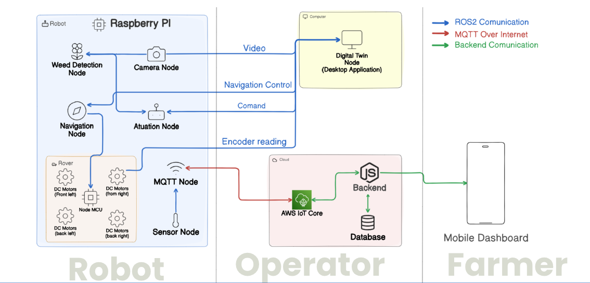

# Precision Farming Robot 2.0

An autonomous precision agriculture robot system combining embedded firmware, ROS2-based control, computer vision, and remote monitoring via desktop and mobile clients.

---

## Table of Contents

- [Project Overview](#project-overview)
- [System Architecture](#system-architecture)
- [Repository Structure](#repository-structure)
- [Hardware](#hardware)
- [Components](#components)
  - [Firmware — Motor Controller (Arduino Uno)](#firmware--motor-controller-arduino-uno)
  - [Firmware Sensors — Sensor Node (Arduino Nano)](#firmware_sensors--sensor-node-arduino-nano)
  - [Raspberry Pi — ROS2 Control Stack](#raspberry-pi--ros2-control-stack)
  - [Weed Detection Node](#weed-detection-node)
  - [Desktop Client (Digital Twin)](#desktop-client-digital-twin)
  - [Mobile App](#mobile-app)
- [ROS2 Topic Map](#ros2-topic-map)
- [Getting Started](#getting-started)
- [Development](#development)
- [License](#license)

---

## Project Overview

The Precision Farming Robot 2.0 is a 4-wheel differential-drive robot designed for autonomous field operations such as weed detection and targeted treatment. The system is organized into independently deployable layers:

- **Embedded firmware** on two Arduino microcontrollers (motor actuation + sensor acquisition)
- **ROS2 Jazzy** control stack running on a Raspberry Pi (motor control, odometry, IMU, camera, MQTT bridge)
- **Computer vision pipeline** using YOLO and ArUco markers for weed detection and field mapping
- **Desktop client** (Qt6 C++) for live telemetry, digital twin visualization, and command control
- **Mobile app** for field-side remote operation and data visualization

---

## System Architecture



---

## Repository Structure

```
Precision-Farming-Robot-2.0/
├── firmware/               # Arduino Uno — motor + servo controller
├── firmware_sensors/       # Arduino Nano — IMU sensor + laser node
├── raspberry-pi/           # Raspberry Pi ROS2 workspace (ros2_robot_ws/)
├── weed-detection-node/    # ROS2 weed detection node (ArUco + YOLO)
├── ros2_ws/                # Additional ROS2 workspace (weed_detection package)
├── desktop-client/         # Qt6 C++ desktop app (digital twin, telemetry)
├── mobile-app/             # Mobile control and monitoring app
├── ros2/                   # ROS2 documentation and package stubs
├── test_nodes/             # Test utilities (camera publisher, ArUco test scenes)
├── detect_weed.py          # Standalone weed detection script
├── Weed_Detection_YOLO_FYP.ipynb  # YOLO training notebook
└── yolo.pt                 # Trained YOLO model weights
```

---

## Hardware

### Robot Platform

| Component | Details |
|-----------|---------|
| Main computer | Raspberry Pi 4B (Ubuntu 24.04, ROS2 Jazzy) |
| Motor MCU | Arduino Uno (Adafruit Motor Shield v1) |
| Sensor MCU | Arduino Nano (ATmega328P) |
| Drive system | 4x DC motors with quadrature encoders |
| Motor driver | L298N (controlled from Raspberry Pi GPIO) |
| IMU | MPU-9250 (on Nano via I2C) / MPU6050 (on RPi via I2C) |
| Camera | Raspberry Pi Camera or USB/V4L2 webcam |
| Laser | Digital laser module (D7 on Nano) |
| Power | 12V for motors, 5V for Raspberry Pi |

### GPIO Pin Assignments (Raspberry Pi → L298N)

| Motor | IN1 | IN2 | PWM |
|-------|-----|-----|-----|
| Motor 1 — Front Left | GPIO 17 | GPIO 27 | GPIO 22 |
| Motor 2 — Front Right | GPIO 23 | GPIO 24 | GPIO 25 |
| Motor 3 — Rear Left | GPIO 5 | GPIO 6 | GPIO 12 |
| Motor 4 — Rear Right | GPIO 13 | GPIO 19 | GPIO 26 |

### Encoder Pins (Raspberry Pi)

| Encoder | A | B |
|---------|---|---|
| Motor 1 | GPIO 4 | GPIO 14 |
| Motor 2 | GPIO 15 | GPIO 18 |
| Motor 3 | GPIO 2 | GPIO 3 |
| Motor 4 | GPIO 7 | GPIO 8 |

### Arduino Nano Wiring

```
Arduino Nano ──── MPU-9250
  A4 (SDA) ──────── SDA
  A5 (SCL) ──────── SCL
  3.3V ───────────── VCC
  GND ────────────── GND

Arduino Nano ──── Laser Module
  D7 ─────────────── Signal (IN)
  5V ─────────────── VCC
  GND ────────────── GND

Arduino Nano ──── Raspberry Pi (SPI)
  D10 (SS) ──────── CE0  (GPIO 8)
  D11 (MOSI) ─────── MOSI (GPIO 10)
  D12 (MISO) ─────── MISO (GPIO 9)
  D13 (SCK) ──────── SCLK (GPIO 11)
  GND ────────────── GND
```

---

## Components

### `firmware/` — Motor Controller (Arduino Uno)

Runs on an **Arduino Uno** with the **Adafruit Motor Shield v1**. Controls 4 DC motors and 2 servos over USB Serial. Receives 6-byte command packets from the Raspberry Pi.

**Features:**
- 4 DC motors via Adafruit Motor Shield (channels 1–4)
- 2 servos on D10 (Servo 1) and D9 (Servo 2)
- Convenience movement commands: forward, backward, turn left/right, rotate CW/CCW
- 6-byte signal protocol: `[Dir1, Speed1, Dir2, Speed2, Dir3, Speed3]`
- USB Serial at 115200 baud
- Reset cause reporting (power-on, brown-out, watchdog, external reset)

**6D Signal Protocol:**

| Byte | Field | Values |
|------|-------|--------|
| 0 | Motor 1 Direction | `0`=Forward, `1`=Backward, `2`=Stop |
| 1 | Motor 1 Speed | 0–255 |
| 2 | Motor 2 Direction | `0`=Forward, `1`=Backward, `2`=Stop |
| 3 | Motor 2 Speed | 0–255 |
| 4 | Motor 3 Direction | `0`=Forward, `1`=Backward, `2`=Stop |
| 5 | Motor 3 Speed | 0–255 |

**Build & Flash:**

```bash
cd firmware
pio run                      # Compile
pio run --target upload      # Flash to /dev/ttyUSB0
pio device monitor           # Open serial monitor
```

**Dependencies:** `adafruit/Adafruit Motor Shield library@^1.0.1`, `arduino-libraries/Servo@^1.2.2`

---

### `firmware_sensors/` — Sensor Node (Arduino Nano)

Runs on an **Arduino Nano (ATmega328P)**. Acts as an SPI slave to the Raspberry Pi, reads a 9-DOF MPU-9250 IMU over I2C at 100 Hz, and controls a laser module.

**Features:**
- MPU-9250 IMU: accelerometer, gyroscope, magnetometer (I2C `0x68`)
- SPI slave: receives 2-byte command from RPi, replies with 18-byte IMU packet
- Laser on/off via SPI command or USB Serial text command
- Live curses monitor (`main.py`): bar charts, sparklines, laser toggle
- Structured error blink patterns (IMU not found, calibration failed, read stall)

**SPI Protocol:**

*RPi → Nano (2 bytes):*

| Byte | Field | Values |
|------|-------|--------|
| 0 | Command | `0x00`=laser off, `0x01`=laser on, `0xFF`=NOP |
| 1 | Reserved | ignored |

*Nano → RPi (18 bytes, 9× int16_t big-endian):*

| Bytes | Field | Units |
|-------|-------|-------|
| 0–1 | ax | mg (×1000) |
| 2–3 | ay | mg (×1000) |
| 4–5 | az | mg (×1000) |
| 6–7 | gx | dps (×10) |
| 8–9 | gy | dps (×10) |
| 10–11 | gz | dps (×10) |
| 12–13 | mx | µT (×10) |
| 14–15 | my | µT (×10) |
| 16–17 | mz | µT (×10) |

**USB Serial Commands:**

| Command | Action |
|---------|--------|
| `LASER_ON` | Turn laser ON |
| `LASER_OFF` | Turn laser OFF |

**Error Blink Patterns:**

| Error | Pattern | Cause |
|-------|---------|-------|
| IMU not found | 2 fast pulses (100ms), 1s gap | SDA/SCL wiring or 3.3V power issue |
| Calibration failed | 3 medium pulses (200ms), 1s gap | Sensor moved during power-on calibration |
| IMU read stall | SOS `· · · — — — · · ·` | I2C lockup at runtime — reset board |
| Startup OK | 1 long pulse (600ms) | Normal boot |

**Build & Flash:**

```bash
cd firmware_sensors
pio run                      # Compile
pio run --target upload      # Flash to /dev/ttyUSB0
pio device monitor           # Serial monitor at 115200
```

**Desktop Monitor:**

```bash
pip install pyserial
python3 main.py              # Live curses dashboard
# SPACE = toggle laser, Q/ESC = quit
```

---

### `raspberry-pi/` — ROS2 Control Stack

Full **ROS2 Jazzy** workspace running on the Raspberry Pi. Implements the core robot control, sensor fusion, odometry, camera publishing, and MQTT bridging.

**ROS2 Packages:**

#### `motor_control`
- Node: `motor_driver`
- Subscribes: `/cmd_vel` (`geometry_msgs/Twist`)
- Converts velocity commands to L298N PWM signals using differential drive kinematics
- Parameters: `wheel_base` (0.2m), `wheel_radius` (0.05m), `max_speed` (1.0 m/s)

#### `imu_sensor`
- Node: `imu_node`
- Publishes: `/imu/data` (`sensor_msgs/Imu`)
- Reads MPU6050 via I2C bus 1 at address `0x68`
- Parameters: `update_rate` (50 Hz), `i2c_bus` (1), `i2c_address` (0x68)

#### `encoder_odometry`
- Node: `encoder_node`
- Publishes: `/odom` (`nav_msgs/Odometry`)
- Reads quadrature encoder counts from GPIO, calculates position and heading
- Parameters: `wheel_radius` (0.05m), `wheel_base` (0.2m), `counts_per_rev` (20), `update_rate` (20 Hz)

#### `robot_controller`
- Node: `robot_controller`
- Subscribes: `/cmd_vel`, `/imu/data`, `/odom`
- Publishes: `/cmd_vel_filtered`, `/robot_status`
- Coordinates all subsystems, validates commands, enforces velocity limits, manages emergency stops
- Parameters: `control_loop_rate` (20 Hz), `max_linear_velocity` (1.0 m/s), `max_angular_velocity` (2.0 rad/s), `min_battery_voltage` (7.0V)

#### `camera_sensor`
- Nodes: `camera_node` (Pi camera), `webcam_node` (USB V4L2)
- Publishes: `/camera/raw` (`sensor_msgs/Image`)
- Parameters: `device_index`, `image_width` (640), `image_height` (480), `publish_rate` (30 Hz)

#### `mqtt_bridge`
- Node: `mqtt_bridge_node`
- Bridges ROS2 topics to MQTT for mobile app backend

| ROS2 Topic | MQTT Topic | Notes |
|---|---|---|
| `/robot_status` | `robot/status` | String passthrough |
| `/detections/results` | `robot/detections` | JSON + cached odometry |
| `/odom` | `robot/odom` | x, y, theta, vx, heading_deg |
| `/camera/detection` | `robot/image` | Base64 image, throttled |
| `/imu/data` | `robot/imu` | heading, roll, pitch, accel, gyro |

Parameters: `mqtt_host` (localhost), `mqtt_port` (1883), `odom_rate_hz` (1.0), `image_rate_hz` (0.5), `imu_rate_hz` (1.0), `image_format` (png/jpeg)

**Differential Drive Kinematics:**

```
v_left  = v_x − (v_z × L / 2)
v_right = v_x + (v_z × L / 2)
```

Where `v_x` = linear velocity (m/s), `v_z` = angular velocity (rad/s), `L` = wheel base.

**Quick Start:**

```bash
cd raspberry-pi/ros2_robot_ws

# Build
./setup.sh

# Source workspace
source install/setup.sh

# Launch all nodes
ros2 launch robot robot.launch.py

# Send movement commands (separate terminal)
ros2 topic pub /cmd_vel geometry_msgs/msg/Twist \
  '{linear: {x: 0.5}, angular: {z: 0}}'

# Launch camera
./start_node.sh webcam          # USB webcam
./start_node.sh camera          # Raspberry Pi camera
```

**Individual Node Launch:**

```bash
source install/setup.sh
ros2 run motor_control motor_driver
ros2 run imu_sensor imu_node
ros2 run encoder_odometry encoder_node
ros2 run robot_controller robot_controller
```

**Build a single package:**

```bash
colcon build --packages-select motor_control
```

**Tune parameters at runtime:**

```bash
ros2 run imu_sensor imu_node --ros-args -p update_rate:=100.0
ros2 run motor_control motor_driver --ros-args -p wheel_base:=0.25 -p wheel_radius:=0.06
```

---

### `weed-detection-node/`

ROS2 node pipeline for field mapping and weed detection using **ArUco markers** and **YOLO**.

**Nodes:**

#### `aruco_processor`
- Subscribes: `camera/raw` (`sensor_msgs/Image`)
- Publishes: `camera/annotated`, `image/coordinates` (JSON)
- Detects ArUco markers (DICT_4X4_50) in each camera frame
- Reports center coordinates, corners, and marker IDs per frame
- Also runs as a standalone CLI tool:

```bash
python3 aruco_processor.py --image field.jpg --output annotated.jpg --show
```

#### `image_publisher`
Publishes static or recorded images to `camera/raw` for testing.

#### `image_viewer` / `pretty_viewer`
Subscriber nodes for visualizing annotated camera output.

**YOLO Detection:**

The trained model (`yolo.pt`) and training notebook (`Weed_Detection_YOLO_FYP.ipynb`) are in the root of the repository. The standalone script `detect_weed.py` runs inference on images without ROS2.

```bash
python3 detect_weed.py
```

**Test Scenes:**

Pre-generated ArUco test images are in `weed-detection-node/` and `test_nodes/camera_pub_raw/data/` for offline testing without a physical camera.

---

### `desktop-client/` — Digital Twin

Qt6 C++ desktop application for real-time robot monitoring, command control, and digital twin visualization. Optionally integrates with ROS2; runs in standalone/simulation mode when ROS2 is unavailable.

**Stack:** C++17, Qt6 (`Core`, `Gui`, `Widgets`, `Network`), optional ROS2

**Startup flow:** `main.cpp` → `Application` → `ROS2Interface` → `DigitalTwin` → `MainWindow` + `WidgetManager`

**Widgets (dockable, add/remove at runtime):**

| Widget | Description |
|--------|-------------|
| Video Stream | Live camera feed from `camera/raw` |
| Motion Control | Velocity joystick / slider control |
| Command & Control | Robot command buttons |
| Sensor Data | IMU and telemetry readout |
| Coordinates | Live position from `/coordinates` |
| Detection Panel | Weed/marker detection results |
| Robot Map View | 2D field map |
| Robot Model | 3D OBJ model viewer (OpenGL) |

**ROS2 Topics:**

| Direction | Topic | Type |
|-----------|-------|------|
| Published | `/cmd_vel` | `geometry_msgs/Twist` |
| Published | `/robot_command` | `std_msgs/String` |
| Subscribed | `camera/raw` | `sensor_msgs/Image` |
| Subscribed | `/imu/data` | `sensor_msgs/Imu` |
| Subscribed | `/robot_status` | `std_msgs/String` |
| Subscribed | `/coordinates` | `geometry_msgs/PointStamped` |
| Subscribed | `image/coordinates` | `std_msgs/String` (JSON) |

**Digital Twin Modes:**

| Mode | Description |
|------|-------------|
| Synchronized | Mirrors live ROS2 robot state |
| Simulated | Internal physics simulation, no robot required |
| Offline | Standalone, no data sources |

**Build & Run:**

```bash
cd desktop-client

# Build (auto-detects ROS2)
./build.sh clean release
# or debug
./build.sh clean debug

# Run
./run.sh
```

**Manual CMake:**

```bash
mkdir -p build && cd build
cmake .. -DCMAKE_BUILD_TYPE=Release -DUSE_ROS2=ON
make -j$(nproc)
```

**Build without ROS2:**

Leave `ROS_DISTRO` unset before running `./build.sh` — the script sets `-DUSE_ROS2=OFF` automatically.

**Logs:** `PrecisionFarmingClient.log` in the working directory.

**Requirements:** Linux (Ubuntu recommended), CMake ≥ 3.16, C++17, Qt6 dev packages, optional ROS2.

**Add a new widget:**

1. Create class inheriting `BaseWidget` in `src/ui/widgets/`
2. Add enum case + factory in `WidgetManager`
3. Register source/header in `CMakeLists.txt`
4. Add menu action in `MainWindow` if user-visible

**Add a ROS2 topic:**

1. Add publisher/subscriber in `ROS2Interface`
2. Bridge data via Qt signals
3. Consume in widgets or `DigitalTwin`

---

### `mobile-app/`

Mobile application for remote control and monitoring of the robot from the field.

**Features (planned):**
- Remote control interface
- Real-time telemetry via MQTT
- Detection result visualization
- Field map and coordinate display
- Configuration management

*Detailed setup and build instructions are in [`mobile-app/README.md`](./mobile-app/README.md).*

---

## ROS2 Topic Map

| Topic | Type | Publisher | Subscribers |
|-------|------|-----------|-------------|
| `/cmd_vel` | `geometry_msgs/Twist` | Desktop client, nav stack | `motor_control`, `robot_controller` |
| `/cmd_vel_filtered` | `geometry_msgs/Twist` | `robot_controller` | `motor_control` |
| `/imu/data` | `sensor_msgs/Imu` | `imu_sensor` | `robot_controller`, desktop client, `mqtt_bridge` |
| `/odom` | `nav_msgs/Odometry` | `encoder_odometry` | `robot_controller`, `mqtt_bridge` |
| `/robot_status` | `std_msgs/String` | `robot_controller` | desktop client, `mqtt_bridge` |
| `camera/raw` | `sensor_msgs/Image` | `camera_sensor` | `aruco_processor`, desktop client |
| `camera/annotated` | `sensor_msgs/Image` | `aruco_processor` | desktop client |
| `image/coordinates` | `std_msgs/String` | `aruco_processor` | desktop client |
| `/detections/results` | `std_msgs/String` | `yolo_detection` | `mqtt_bridge` |
| `/coordinates` | `geometry_msgs/PointStamped` | various | desktop client |
| `/mqtt_bridge/status` | `std_msgs/String` | `mqtt_bridge` | monitoring |
| `robot/status` | MQTT | `mqtt_bridge` | mobile app |
| `robot/odom` | MQTT | `mqtt_bridge` | mobile app |
| `robot/imu` | MQTT | `mqtt_bridge` | mobile app |
| `robot/image` | MQTT | `mqtt_bridge` | mobile app |
| `robot/detections` | MQTT | `mqtt_bridge` | mobile app |

---

## Getting Started

### Prerequisites

| Component | Requirement |
|-----------|-------------|
| Raspberry Pi | Pi 4B or newer, Ubuntu 24.04 |
| ROS2 | Jazzy (Humble also supported with minor changes) |
| Motor MCU | Arduino Uno + Adafruit Motor Shield v1 |
| Sensor MCU | Arduino Nano (ATmega328P) |
| Build tools | PlatformIO CLI for firmware |
| Desktop | Linux, Qt6 dev packages, CMake ≥ 3.16, C++17 |
| Python | 3.10+, `pyserial`, `paho-mqtt`, `numpy`, `Pillow`, `opencv-python` |

### Full System Startup

1. **Flash firmware:**
   ```bash
   cd firmware && pio run --target upload         # Arduino Uno
   cd firmware_sensors && pio run --target upload  # Arduino Nano
   ```

2. **Build and launch ROS2 on Raspberry Pi:**
   ```bash
   cd raspberry-pi/ros2_robot_ws
   ./setup.sh
   source install/setup.sh
   ros2 launch robot robot.launch.py
   ```

3. **Start MQTT bridge (if using mobile app):**
   ```bash
   ros2 run mqtt_bridge mqtt_bridge_node \
     --ros-args -p mqtt_host:=<broker_ip>
   ```

4. **Launch desktop client:**
   ```bash
   cd desktop-client
   ./run.sh
   ```
   Connect to ROS2 from the `ROS2 → Connect` menu.

5. **Verify topics:**
   ```bash
   ros2 topic list
   ros2 topic echo /robot_status
   ros2 topic hz /camera/raw
   ```

### Troubleshooting

| Problem | Check |
|---------|-------|
| Motor not responding | GPIO wiring matches pin table; L298N 12V supply |
| IMU not detected (RPi) | `i2cdetect -y 1` — MPU6050 at `0x68` |
| IMU not found (Nano) | Check SDA=A4, SCL=A5, 3.3V on MPU-9250; 2-pulse blink = not found |
| Camera not streaming | `ros2 topic hz /camera/raw`; check V4L2 device index |
| Desktop client wrong color | Source encoding `bgr8` vs `rgb8` — auto-corrected for `bgr8` |
| Desktop build fails | Ensure Qt6 dev packages installed; unset `ROS_DISTRO` for stub build |
| MQTT not connecting | Check broker IP/port; `ros2 topic echo /mqtt_bridge/status` |
| Nodes won't start | `echo $ROS_DISTRO`; `colcon build --symlink-install` |

---

## Development

### Adding a ROS2 Node

1. Create a package under `raspberry-pi/ros2_robot_ws/src/`
2. Implement the node in C++ (with `CMakeLists.txt` and `package.xml`) or Python
3. Register in `robot.launch.py`
4. Add MQTT bridging if mobile visibility is needed

### Modifying Firmware

- Motor controller: edit `firmware/src/` and `firmware/include/`
- Sensor node: edit `firmware_sensors/src/` and `firmware_sensors/include/`
- Rebuild with `pio run --target upload`

### Extending the Desktop Client

See [Add a new widget](#add-a-new-widget) and [Add a ROS2 topic](#add-a-ros2-topic) in the Desktop Client section.

### Weed Detection Training

The YOLO model was trained using `Weed_Detection_YOLO_FYP.ipynb`. To retrain or fine-tune, open the notebook and update the dataset path. The output model weights replace `yolo.pt`.

---

## License

License information to be added.

---

## Contact

Contact information to be added.
